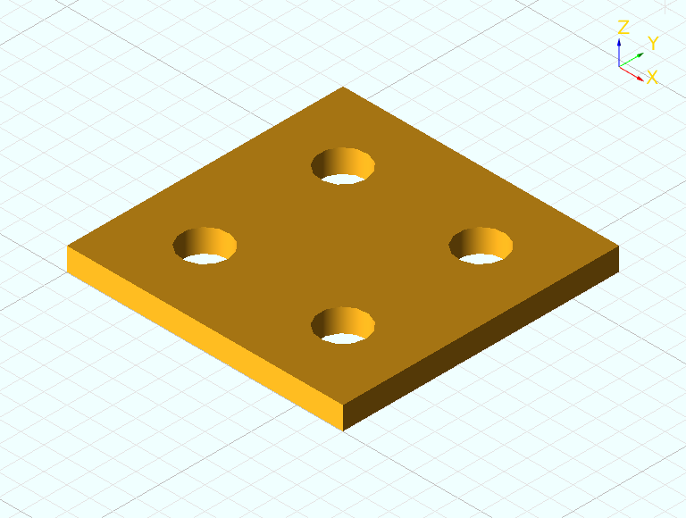

# ReactCAD

ReactCAD is an open-source 3D modelling system for programmers. Models are written as React components in TypeScript or JavaScript and compiled in the browser by a fast WebAssembly library.

Create your design as code in your favorite editor and view a hot-reloading preview as you work. Export to STEP, BREP or STL, or publish your part to NPM so others can incorporate it into their own models.

Publish to the web on GitHub Pages or your own hosting - visitors can view, customize and export your model directly from the browser without downloading any software.

[See the full documentation.](https://react-cad.github.io)

```tsx
<difference>
  <box x={12} y={12} z={1} />
  <translation x={3} y={3}>
    <cylinder height={1} radius={1} />
  </translation>
  <translation x={9} y={3}>
    <cylinder height={1} radius={1} />
  </translation>
  <translation x={3} y={9}>
    <cylinder height={1} radius={1} />
  </translation>
  <translation x={9} y={9}>
    <cylinder height={1} radius={1} />
  </translation>
</difference>
```


## Contributing

Requires yarn and docker. Clone the repository and `yarn install` and `yarn build`. `yarn start` will begin the hot-reloading development environment.

@react-cad uses conventional-commits, follow the prompts when committing.
